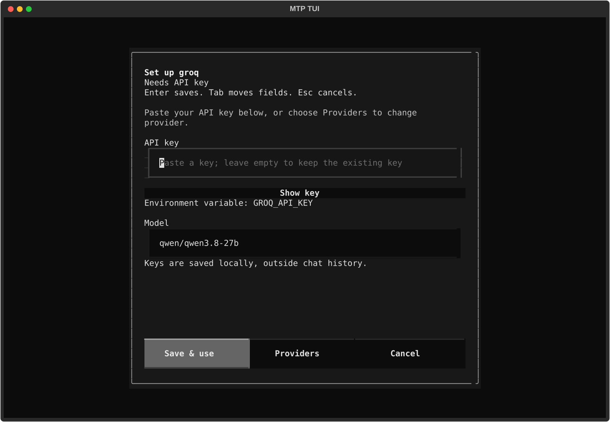

# Audit fixes for 0.1.38

This is the first implementation phase of the CLI/SDK audit. All 18 original
repros are now ordinary passing tests, with their expected-failure markers
removed. The original [audit](audits/cli-sdk-2026-10-03/AUDIT.md) and evidence
remain as the historical baseline.

## Execution and history

- Identical calls retain their requested multiplicity. Phase two also removed
  automatic sharing of pure reads so each call passes its own dependency and
  approval checks. Explicit TTL caching remains inside `execute_call`.
- Failed prerequisites block dependent calls, including references to failed
  results. Skipped calls receive explicit failed results.
- Prior-round results can be supplied to `ToolRegistry.execute_plan` through
  `prior_results`. All four agent execution APIs supply recorded results.
- Every native call gets a reply, including cache hits. Cache suppression no
  longer removes calls from the wire conversation.
- History trimming keeps assistant/tool groups together. The newest group may
  exceed the message limit, which is a soft limit rather than a hard memory cap.
- Lazy loading finds tools advertised by loaders outside their namespace,
  including the TUI's read-only `agent.syntax_check`.

## Provider contracts

- Anthropic, Cohere, and OpenAI map restricted native names deterministically
  and restore registered names for runtime execution. OpenAI forced choices
  use the same mapping as definitions and replay.
- Anthropic preserves signed native blocks and handles the installed SDK's
  removal of temperature. Non-default unsupported sampling values fail clearly.
- Gemini preserves JSON-safe native parts, signatures, and function IDs through
  session storage. Function results replay the original native IDs.
- DeepSeek reasoning models receive tools and retain reasoning state even when
  its display capture is disabled.
- Native Fireworks uses per-instance credentials. Together only retries an
  unsupported parallel keyword, not unrelated authentication/server failures.
- Ollama accumulates calls from separate chunks. Ollama and LM Studio async
  streams no longer put `StopIteration` into an asyncio Future.
- Blocking final streams run in workers, leaving async event loops responsive.
  Canceling a coroutine cannot forcibly terminate an SDK read already running
  in a worker; provider timeouts still bound those reads.
- Groq exposes `max_completion_tokens`, defaulting to 512, in planning,
  finalization, and streaming. GPT-OSS reports no parallel support. SDK and TUI
  model defaults come from one module; explicit saved selections are retained.

## Security and compatibility

- Website requests disable automatic redirects and validate each target before
  following it. This fixes the reproduced redirect gap; it is not a claim of
  OS-level network isolation or connection-level DNS pinning.
- MCP HTTP validates Origin, rejects unsupported version headers, returns 202
  for accepted notifications, and uses the correct unknown-method error.
- MCP declares legacy revisions `2025-11-25`, `2025-06-18`, and `2025-03-26`.
  Unsupported initialize versions negotiate a supported revision. This does
  not implement the modern `2026-07-28` discovery protocol.
- Python 3.11 is the supported minimum in package metadata, doctor, README,
  and scaffold templates. Cerebras extras and doctor check its native SDK.
- CI installs `pytest-asyncio` and requires actual integration tests instead
  of converting an empty selection to success.
- PythonToolkit defaults to restricted arithmetic/collection execution, rejects
  imports, attributes, and introspection, and checks that unsafe opt-in is a
  boolean. Full Python requires `allow_unsafe_exec=True`. Neither mode is an
  operating-system sandbox.
- SDK TUI workspace permissions allow scoped edits and registered read tools.
  Arbitrary shell commands require explicit unrestricted permissions. The
  noninteractive approval handler denies requests it cannot approve.

## Verification

The final non-live suite passed 723 tests with one skipped optional Streamlit
module and 11 live tests deselected. There are no expected failures. The clean
CI-style fast suite passed 698 tests with two optional skips. Wheel CLI smoke
checks passed 29 tests, and the wheel contains all 12 templates, including three
environment templates. CI also installs the dotenv helper used by its tests.

Final counts and versions are saved in
[implementation evidence](audits/cli-sdk-2026-10-03/implementation-evidence.json).
The suite covers all original repros, additional name collisions, persisted
signatures, budgets, async termination, permissions, and toolkit loading.
Groq's live parallel, sequential reference, mixed, streaming, and session probes
passed with synthetic data. Other provider checks use installed SDKs against
loopback fixtures, not live accounts.

The browser connection accepted a synthetic TUI prompt, but screenshot capture
was unavailable and its final turn was not certified. Textual Pilot verified
the changed behavior; status snapshots were exported at 120x40 and 40x15.

## Migration and remaining work

Install from this checkout until 0.1.38 is published. This task builds artifacts
and pushes source to GitHub; it does not publish to PyPI.

Existing model selections are preserved, including retired ones. Select a
current model explicitly if a saved choice is no longer available. Groq defaults
to the tested Qwen model, which the provider currently classifies as preview.
Increase its output budget explicitly for larger workloads when account limits
permit. Requests using unsupported Anthropic sampling now fail instead of
silently ignoring the setting.

Full provider live/multimodal tests, newer Responses APIs, modern MCP discovery,
OS-enforced execution isolation, and the recommended new providers remain later
phases. No new provider adapter was added in this phase.
