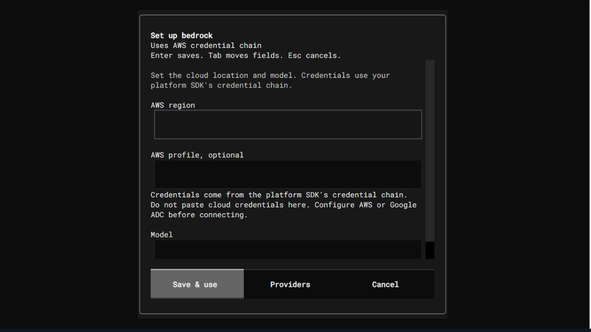

# Implementation phases 6 through 9

Version 0.1.41 completes the scoped implementation work from the remaining
audit phases. Verification uses official SDKs, independent MCP clients,
loopback fixtures, real CI services, and the configured free-tier accounts.
PyPI publication remains blocked by missing publishing access.

## Phase 6: MCP features

`ModernMCPFeatures` adds opt-in SSE progress and disconnect cancellation,
bounded identity-scoped subscriptions, and MRTR roots/sampling/elicitation.
Resumes use protected, expiring state, validate client responses, and prevent
duplicate continuation execution. Tool continuations retain registry policy
and approval checks. OAuth resource discovery and authorization-server metadata
are available for explicitly configured deployments and token authorizers.

The independent official MCP 2.3.0 client passed discovery, tools, SSE progress,
subscriptions, and MRTR tests. It exposed missing cache hints, which now default
to private cache scope and zero TTL. Final review also fixed late progress from
a completed stdio request leaking into a new request that reused its ID.

OAuth issuance, signature/introspection validation, external issuer availability,
and durable resume storage belong to the configured deployment. This package
does not manufacture trusted tokens or an identity provider. Synchronous worker
code still needs cooperative cancellation. See [modern MCP](MCP_MODERN.md) and
[HTTP features](MCP_STREAMABLE_HTTP.md).

## Phase 7: SDK capabilities

Compatible and Responses adapters support opt-in native AsyncOpenAI requests,
streams, and finalization. Groq has a native AsyncGroq path. Explicit Responses
image/file inputs and strict output schemas include local JSON Schema
validation. Exact-model hints describe known documentation without silently
changing model choices or enabling unsupported features.

Binary image/audio/video/file content survives session persistence and replay.
Agent finalization and planning streams close immediately on event-consumer
closure or cancellation. Existing sync APIs and conservative capability defaults
remain available. Native async support is declared per adapter; Bedrock and
other synchronous SDK paths accurately retain their thread bridge.

This adds Responses image/file inputs, not generated media or a universal
audio/video API. Server schema support remains model-dependent. Old records
whose binary content was already lost cannot recover missing bytes from this
fix. See [SDK capabilities](SDK_CAPABILITIES.md).

## Phase 8: enterprise providers

Azure/Foundry, xAI, Bedrock Converse/ConverseStream, and Vertex adapters have
explicit configuration, native history/call-ID replay, installed-SDK contract
tests, and CLI/TUI setup. Azure supports refreshed Entra credentials; Bedrock
uses the AWS credential chain; Vertex uses Google ADC. Setup stores deployment,
endpoint, region/profile, or project/location without pasting cloud credentials
into conversation history.

The four adapters require explicit model/deployment IDs. They do not provision
accounts or enable paid resources. Native async, schema, and media support vary
by adapter and selected model. See [enterprise providers](ENTERPRISE_PROVIDERS.md).

## Phase 9: verification and release

| Check | Verified result |
|---|---|
| Full local non-live suite after worker-order fix | 1,216 passed, 8 service-dependent skips, 11 live tests deselected |
| Isolated installed wheel, optional SDKs absent | 373 passed, 10 optional SDK/service skips |
| Native SDK plus media/session checks | 85 passed |
| Enterprise adapters and CLI setup | 76 passed |
| Resumed-review cleanup and MCP checks | 27 passed |
| Declared minimum Textual 8.2.8 | 28 TUI lifecycle/setup tests passed |
| Optional Streamlit streaming | 5 passed |
| Complete TUI regression suite after worker-order fix | 201 passed |
| Typed Azure authentication settings follow-up | 13 passed |
| Python/platform matrix | All 13 jobs passed across 3.11, 3.12, and 3.13 on Linux, Windows, and macOS |
| Real services in CI | PostgreSQL, MySQL, local Ollama, and Docker execution passed |
| Distribution checks | Wheel/source built, Twine check passed, installed CLI/scaffold passed |

The original `textual>=1.0.0` requirement was inaccurate: Textual 1.0 lacks
`textual.markup` used by the TUI. Package metadata now declares the explicitly
tested minimum 8.2.8. CI checks that minimum independently of current releases.

A repeated macOS 3.13 run caught a real worker-ordering race after an earlier
matrix passed. The terminal worker event could overtake queued streaming
messages and save an empty failed turn. A per-run event channel now drains before
failure/cancellation persistence and closes against late callbacks. Tests
deliberately withhold UI delivery to prove preservation, one save per turn,
and isolation from the next conversation. Azure setup also retains boolean
types instead of converting a hand-edited `"false"` string into enabled Entra
authentication.

SQL checks cover native state, Unicode, update semantics, user scope, concurrent
sessions, parameterized literal SQL inputs, and exact binary media replay.
Ollama CI downloads a small official model into an isolated temporary service.
These service tests replace local skips with real server behavior. The local
eight skips are one Docker case, six database cases, and one Ollama case because
those local services are not running. Cohere emits one upstream Pydantic
deprecation warning. SDK test skips in the clean wheel environment are optional
dependencies; the full environment and CI integration tier run those contracts.

Free-tier live inference passed Groq, native async Groq, Gemini, and an
OpenRouter model whose public catalog listed zero input/output price and tools.
Gemini needed one retry after a 503. OpenRouter's initial paid default returned
402; the explicitly free catalog variant then passed. Prior configured OpenAI
and Xiaomi keys returned 401. Those failures are retained in the evidence.
After the user's free-tier-only clarification, no further paid-provider
inference was requested. Live enterprise accounts remain unverified by choice.

The latest Groq Qwen probe also passed parallel, sequential references, and mixed
batches, including observed overlap for independent calls. Additional GPT-OSS
probes did not satisfy those batch expectations. GPT-OSS is already declared to
lack parallel tool support; these results are retained as limits and are not
reported as general Groq certification.

The built 0.1.41 artifacts and GitHub artifact-upload workflow are ready.
No usable PyPI publishing credential was found in the environment, `.pypirc`,
or the PyPI keyring entry. Upload cannot be completed without project-owned
publishing access. Exact commands are in [publishing](PUBLISHING.md).

## TUI and saved evidence

Eight enterprise setup scenarios passed at 40x15 and 100x35 terminals. The
live Bedrock form was inspected through the browser at loopback port 8769.
Its credential-chain inputs and hidden key controls render correctly. Browser
keyboard forwarding did not consistently deliver Escape to the terminal, so
keyboard save/cancel certification uses the actual Textual test runner.
No enterprise credentials or inference were submitted through the form.

Safe live reports, dependency versions, CI links, implementation commits, and
publication status are recorded in
[verification evidence](audits/phases-6-9-2026-10-05/verification.json).

The [final implementation matrix](https://github.com/GodBoii/Model-Tool-protocol-/actions/runs/37345691181)
passed all 13 jobs at commit `859e611`, including the final worker-ordering and
typed-authentication fixes. The same commit passed
[real service certification](https://github.com/GodBoii/Model-Tool-protocol-/actions/runs/37345691109),
[distribution validation](https://github.com/GodBoii/Model-Tool-protocol-/actions/runs/37345691567),
[docs checks](https://github.com/GodBoii/Model-Tool-protocol-/actions/runs/37345691210),
and [MCP smoke](https://github.com/GodBoii/Model-Tool-protocol-/actions/runs/37345691199).

The report commit following these checks changes documentation and saved
evidence only. PyPI still lists 0.1.40; the prepared 0.1.41 upload has not occurred.
