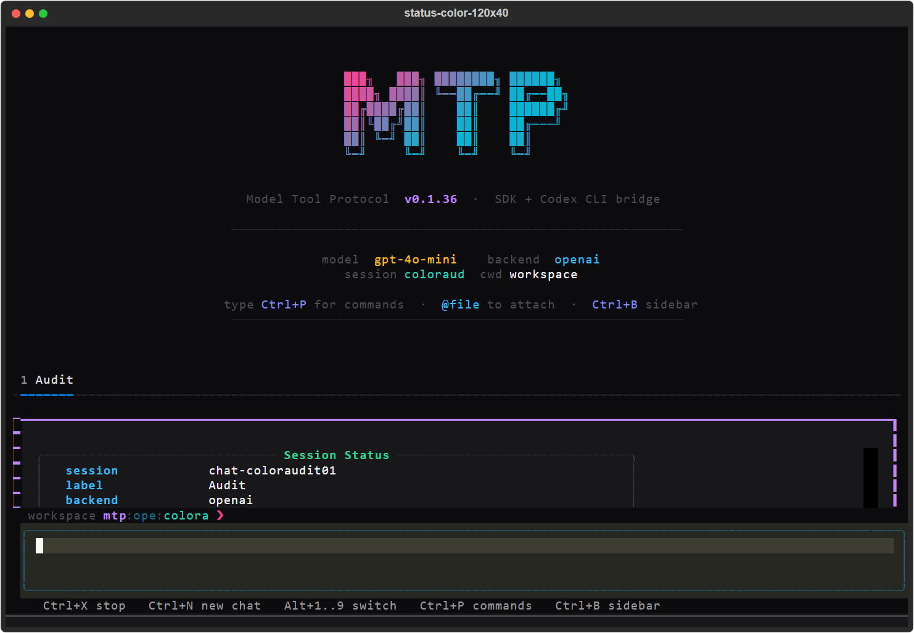
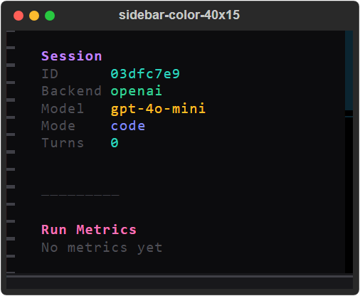

# MTP TUI usability audit

Audited on 30 September 2026, on `main` at `2fdf190`. MTP 0.1.36, Python 3.13, Textual 8.2.5, Windows.

The TUI starts and many individual commands work, but ordinary navigation exposes several problems that the current tests miss. Fix the screen layout, the palette's New Chat crash, multiline input, and per-chat composer state first.

This section records the initial audit before fixes. The subsequent changes and verification are in the [follow-up](TUI_UX_VERIFICATION.md); the operating instructions are in the [TUI guide](TUI_OPERATING_GUIDE.md).

## How I tested

- Launched the installed, editable checkout with `mtp tui --backend openai --session-db <audit-root>/native-sessions --cwd <repo>`. Entered `/status` through the terminal and exited with Ctrl+D.
- Operated the actual Textual application with Pilot keyboard and mouse events. Commands went through `InputArea`, command parsing, and real handlers. Ordinary command tests dismissed autocomplete before Enter; separate tests exercised natural completion and palette selection.
- Tested 120×40, 80×24, 60×20, 40×15, and 160×50 terminal sizes. Captured the application's actual SVG frames and rendered selected frames to PNG. The PNG window decoration comes from Rich's export, not Windows Terminal.
- Used a temporary workspace containing Python, Markdown, a child directory, and a filename and directory containing spaces. Session and provider settings used separate temporary stores.
- The first pass recorded 124 command attempts and 169 observations. The color pass recorded 44 dispatched commands plus further interaction checks. Five subsequent command attempts after the palette crash are excluded from successful coverage. Independent fresh-app probes reproduced the crashes and checked navigation.
- The tool environment initially had `NO_COLOR=1` and `TERM=dumb`. Repeated visual checks after removing `NO_COLOR` and setting a true-color terminal. Grayscale in the first pass is an environment effect, not an application defect.
- Guards rejected any attempt to send a chat prompt, start a run, or build a harness agent. Recorded states contain zero transcript turns and no agents. Both audit settings stores contain zero API keys. No live chat or AI agent ran.

112 existing offline tests passed. The first group passed 49 tests:

```powershell
python -m pytest tests/test_tui_command_completion.py tests/test_tui_settings_cache.py tests/test_tui_indexes.py tests/test_tui_persistence.py tests/test_tui_attachments.py tests/test_tui_stream_markdown.py tests/test_tui_scan_routing.py -q
```

The second group passed 63 tests, with three chat-related cases deselected:

```powershell
python -m pytest tests/test_session_store.py tests/test_docs_consistency.py tests/test_tui_codex_auth_commands.py tests/test_tui_codex_metadata.py tests/test_tui_stream_merge.py -k 'not streams_deltas and not run_mtp_prompt' -q
```

## Findings to fix first

P1 means a common interaction breaks the interface, terminates the application, or changes the context or permissions unexpectedly. P2 means a broken command or workflow with a workaround. P3 means a discoverability or polish limitation.

| Priority | Finding | Reproduction and observed result | Suggested improvement |
| --- | --- | --- | --- |
| P1 | New Chat in the command palette crashes | Ctrl+P, search `New Chat`, Enter. Reproduced three times in fresh instances of the real `MTPApp`. `_rebuild_chat_log` raises `NoMatches` because `#chat-log-body` has not mounted. Ctrl+N works. | Wait for the new conversation's actual mount before rebuilding its log. Add a test that selects New Chat through the palette. |
| P1 | The entire status bar's contents are outside the viewport | At 120×40 the bar is at row 39, but `#status-main` starts at row 40. At 80×24 the child starts at row 24. Every tested size shows only the top border. Backend, model, sandbox, and clickable thinking controls are invisible. | Allocate a content row in addition to the border, or remove the border from the one-row container. Verify rendered child positions and a real click on the thinking control. |
| P1 | The startup banner crowds out tabs and command output | The banner occupies 23 rows at 120×40 and 80×24. At 80×24 the tab row begins at row 23, behind the status bar. At 120×40 `/status` begins at row 26 with a 19-row panel, but the docked composer covers its lower portion. `/help` adds suggestions over the already cramped output. | Replace the persistent splash with a compact empty state, or dismiss it on the first command. Reserve composer and status space before laying out scrollable output. |
| P1 | Shift+Enter does not make a newline | Type `First line`, place the cursor at the end, press Shift+Enter, then type `Second line`. The result is `First lineSecond line`. `/compose` explicitly advertises Shift+Enter. Pasting text containing newlines does work. | Bind Shift+Enter to newline insertion explicitly, and test keyboard entry through `InputArea`. |
| P1 | Drafts and attachments follow the user into another chat | Type an unsent draft, then Ctrl+N or switch tabs. The same draft remains. Attach `hello.py` in chat 1, then Alt+2. Chat 2 shows the same badge and uses the same pending attachment list. | Store drafts, cursor position, and pending attachments on each conversation. Restore them when activating a tab. |
| P1 | Ctrl+W changes permissions while editing | With `workspace-write` active, type `edit these words` and press Ctrl+W. The words remain, while sandbox becomes `danger-full-access`. This overrides TextArea's delete-word binding. The invisible status bar makes the change harder to notice. | Give sandbox selection a distinct shortcut or explicit picker. Preserve familiar editor shortcuts and display permission changes where they can be seen. |

The layout failure is visible even in a fairly large terminal. The status panel below continues underneath the composer.



## Other confirmed defects

| Priority | Finding | Reproduction and observed result | Suggested improvement |
| --- | --- | --- | --- |
| P2 | Malformed command arguments terminate the TUI | `/rounds ²`, `/history ²`, `/switch ²`, and `/close ²` pass `isdigit()` then raise `ValueError` in `int()`. A 4,400-digit `/rounds` argument also raises. `/codex "` raises `ValueError: No closing quotation` before its error handler. | Parse integers and shell arguments inside explicit validation handlers. Return usage errors without ending the app. |
| P2 | A selected filename with spaces is silently lost by the attachment parser | `@file` completion attaches `file with spaces.txt` successfully. Parsing the same reference, as the submission path later does, produces no attachments and no warnings. No prompt was submitted to test this. | Pass attachments as structured paths instead of reconstructing whitespace-delimited `@` text, or implement consistent quoted-path parsing. |
| P2 | `/model add` does not implement its advertised behavior | `/models` advertises `/model add <provider> <name>`. `/model add openai audit-model` instead sets the active model to the literal string `add openai audit-model`. | Implement the subcommand or remove the advertised form. Never acknowledge an unsupported subcommand as a successful model switch. |
| P2 | Invalid sandbox names are accepted and persisted | `/sandbox wrong` stores `wrong` and adds a success message. `/sandbox nonsense` behaves the same way. No provider run was attempted with the invalid state. | Validate against the supported modes before modifying state or saving. Keep the previous mode on invalid input. |
| P2 | `/cd` resolves relative paths against the process directory | With the active workspace set to `<audit-root>/workspace`, `/cd child` looks for `<repo>/child`. `/cd ..` also uses the process directory. Quoted paths retain the quote characters and fail. Unquoted absolute paths containing spaces work. | Resolve relative paths against the active conversation's `cwd`, and support conventional path quoting. Refresh all workspace-related views and indexes afterward. |
| P2 | Local-provider setup ends with an incorrect API-key instruction | Fresh `/backend ollama` and `/backend lmstudio` both say to set an API key first. Neither opens local setup. The settings checker requires local deployment metadata and a base URL; the Textual command handler does not invoke the older interactive setup helper. | Provide a Textual endpoint/model setup flow for local providers and explain missing local configuration. |
| P2 | Opening the sidebar can remove the working area | Sidebar width is fixed at 40 columns. At 80×24 it takes half the screen and truncates useful hints. At 40×15 it occupies the full terminal, leaving the input and main content inaccessible. | Switch to an overlay at narrow widths, constrain its width, and preserve a visible way to dismiss it. |
| P2 | Command feedback uses two different output areas | `/mode` and `/rounds` write into `#cmd-log`; `/model`, `/sandbox`, and `/apikey` write into the chat log after showing an empty command panel. On the initial screen, the chat log is below the splash and often too short to show the confirmation. Ctrl+L leaves command output visible, whereas `/clear` hides it. | Use one predictable command-result area. Make keyboard and slash-command versions of Clear behave consistently. |
| P2 | Thinking's palette description does not match its action | The palette says Thinking opens a control. With Codex active, `/thinking` returns usage text and leaves the ordinary screen active. The actual dialog is reachable through a thinking badge that is currently outside the viewport. | Open the same picker from the palette, slash command, and badge when no value is supplied. |
| P3 | Help interferes with returning to normal typing | `/help` sets the composer to `/`, opens completion, and moves focus to suggestions. Escape closes suggestions but leaves `/` in the composer. Typing `s` afterward produces `/s`, reopening command completion. | Keep help separate from command selection, restore the prior draft, and provide a consistent dismissal action. |
| P3 | Command discovery and validation are uneven | The palette omits commands such as backend/model selection, API-key management, rounds, working directory, research instructions, and switch. Memory completion offers only `on`/`off` although its direct picker offers `show` too. `/autoresearch nonsense` silently disables autoresearch. `/models refresh` behaves like `/models` and does not refresh discovery. `/mode` followed by a tab separator is unknown. | Generate help, completion, palette entries, and parsing from one command specification. Reject unsupported arguments instead of applying a default action. |
| P3 | The workspace tree is informational rather than navigable | Directory nodes have `allow_expand=False`; Enter does not open folders or files. Only the first 30 directory entries are considered, before hidden entries are filtered. There is no indication of omitted entries. | Add expansion and useful file actions, or label it as a limited directory overview. Show an overflow count. |

At 40 columns the sidebar fills the entire working area.



## What worked

- Startup, typing, ordinary slash parsing, unknown-command feedback, and Ctrl+D and `/exit` shutdown worked.
- Mode changes, positive rounds, ordinary model selection, research instructions, and valid explicit sandbox settings updated state.
- Missing cloud-provider credentials produced feedback and kept the existing backend. No provider agent was constructed.
- Ctrl+N and slash `/new`/`reset` created tabs. Keyboard switching and mouse tab selection worked. Invalid tab positions returned errors; closing the only remaining chat was refused.
- Saved-session completion, partial-ID load, and session viewing worked for audit sessions. Session storage, atomic settings writes, corrupt-settings recovery, and background indexes passed the existing tests.
- History and tools gave appropriate empty states. Queue inspection and clearing worked when no run was active.
- Ordinary attachment selection, keeping attachments while executing a command, and Backspace removal worked. The filename-with-spaces badge also worked; the later parser is the failing part.
- Real codebase scanning indexed three fixture files into four chunks. Status, inspection, disabling memory, and scan completion worked without an AI agent.
- Codex backend selection, read-only model catalog refresh, supported reasoning selection, and rejection of unsupported reasoning levels worked. The CLI status-help path ran without changing credentials.
- The boot model label updated in the isolated follow-up check. A suspected stale label was cleared and is not listed as a defect.

## Visual assessment

The logo and colored values are recognizable, and the composer has a clear border and cursor. The main weakness is allocation of space. A decorative 23-row empty state dominates an operational screen, while commands, tabs, and settings compete below it. Several secondary labels use both muted colors and Rich's dim styling, making them hard to read against the dark background. The input hints do not adapt to narrow screens and put Stop first even when no reply is running. Quit and the advertised multiline action are absent from the persistent hint strip.

Keep the existing identity, but reduce the startup treatment to a small header, increase contrast for supporting text, and reserve accent colors for selection, state, and actions. Correct geometry and feedback placement before adding more visual effects.

## Coverage limits

No API key was set, no agent was used, and no chat prompt was sent. Therefore live provider responses, streaming under a real run, cancellation, active queueing, steering, generated titles, tool approvals, tool execution, and live token/usage behavior remain unverified. Existing tests that submit prompts, even through fake chat runners, were excluded from this audit.

Credential-changing actions such as Codex login/logout, actual API-key writes, and Codex configuration repair were not executed. Real Codex account loading and interactive doctor were not operated; auth-related unit tests use temporary files or mocked subprocesses. A working local inference server and authenticated cloud backend were not available for end-to-end testing.

Provider-specific model/thinking screens in the color pass used local state changes equivalent to selecting an initial backend; they do not prove authenticated provider switching. The palette crash interrupted the extended session, so its final five attempted commands are not counted as working checks.

## Evidence and reproduction

The ledgers preserve the exact command arguments, observed state, focus, completion choices, output, and widget geometry. Paths in the ledgers use `<audit-root>`, `<repo>`, and `<python>` to avoid publishing machine-specific locations. Screenshots show only the audit fixtures.

- [Initial command and layout observations](audits/tui-2026-09-30/offline-commands.json)
- [Color and composer interaction observations](audits/tui-2026-09-30/color-and-interactions.json)
- [Fresh-app crash probes and tracebacks](audits/tui-2026-09-30/crash-probes.json)
- [Mouse, keyboard, discovery, and follow-up checks](audits/tui-2026-09-30/navigation.json)
- [80×24 startup capture](audits/tui-2026-09-30/startup-color-80x24.png)
- [Help at 120×40](audits/tui-2026-09-30/help-color-120x40.png)
- [Sidebar at 80×24](audits/tui-2026-09-30/sidebar-color-80x24.png)

To reproduce the common failures manually, start with a temporary `--session-db`, select a backend without configuring a key, and do not enter ordinary chat text followed by Enter. Use Ctrl+P → New Chat for the palette crash; type an unsent draft and use Ctrl+N for shared composer state; attach a fixture and switch tabs for shared attachments; use Shift+Enter inside an unsent draft for multiline behavior. Use `/status` at 80×24 and 120×40 to inspect clipping. Test the numeric and quote failures in separate instances because they terminate the app.

Relevant implementation locations are [the app and command handlers](../src/mtp/cli/tui_app.py), [app styles](../src/mtp/cli/tui_app.tcss), [composer](../src/mtp/cli/tui_widgets/input_area.py), [status bar](../src/mtp/cli/tui_widgets/status_bar.py), [attachment parsing and backend preparation](../src/mtp/cli/tui_workers.py), [palette and slash parsing](../src/mtp/cli/tui_commands.py), and [workspace tree](../src/mtp/cli/tui_widgets/sidebar.py).
