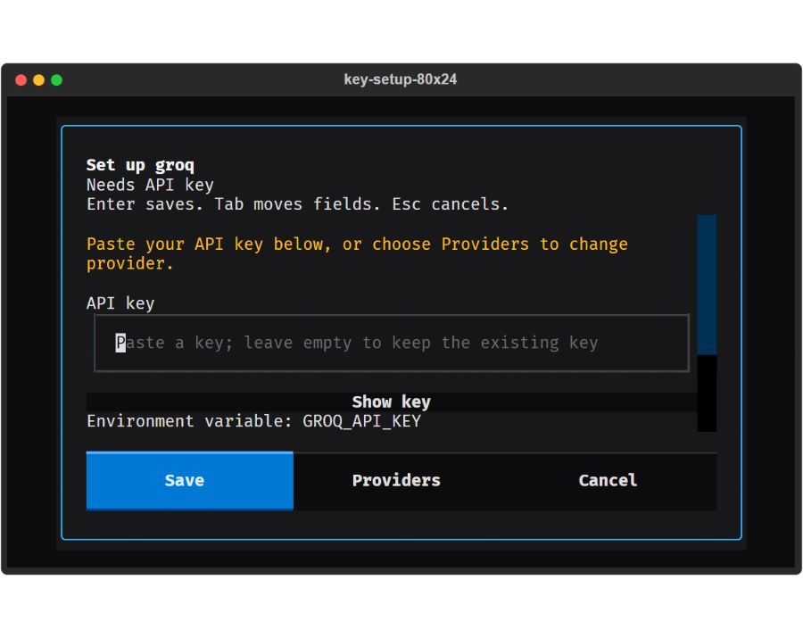
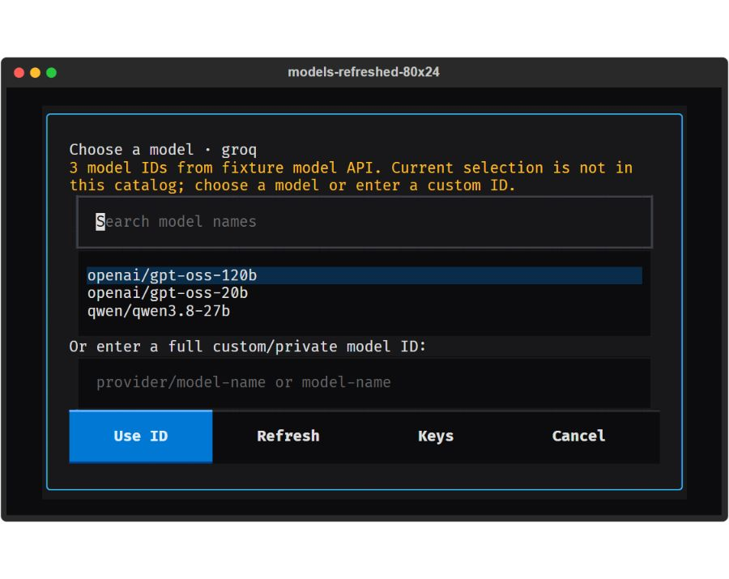
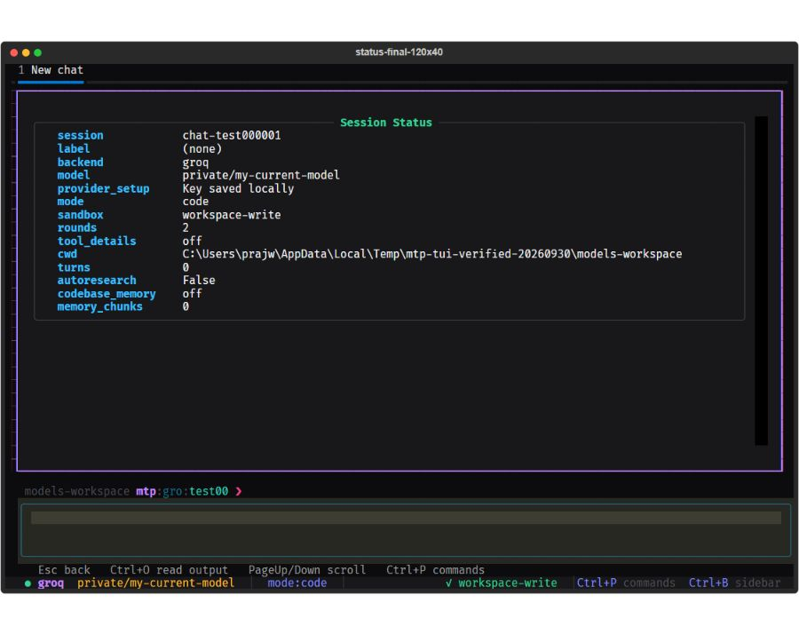

# TUI and CLI fix verification

Follow-up to the [30 September 2026 audit](TUI_UX_AUDIT.md), tested with Python 3.13 and Textual 8.2.5 on Windows. The [operating guide](TUI_OPERATING_GUIDE.md) describes the current flows.

## Implemented and verified

| Area | Result |
| --- | --- |
| Provider setup | Missing configuration opens a masked key form with Save, Providers, and Cancel. Empty, masked, whitespace-containing, and placeholder keys are rejected. Save failures leave the form open. |
| First saved key | Saving a key initializes a default model, fixing the former readiness failure for new providers. Saved and environment credentials both work with readiness checks. |
| Credentials | Existing keys are not prefilled. The legacy composer command is redacted in input history. `/apikey show` masks keys. Saved-key removal is confirmed. Credentials stay outside session transcripts. |
| Local inference setup | Ollama and LM Studio ask for an endpoint and model instead of requiring a key. Their setup forms can load models, report invalid URLs/server failures, and accept manual IDs. |
| Provider selection | Selection is separate from agent construction. Setup and model selection never generate a reply. Cancel preserves the current provider; successful selection persists in the intended chat. |
| Model selection | Searchable fetched catalogs, refresh, cached source labels, and manual/private IDs. `/model add` now adds an ID instead of changing the active model to the whole command string. |
| Catalog refresh | Replaces API snapshots without reintroducing omitted defaults. Keeps manual IDs. Access, rate-limit, network, malformed-response, pagination, and cancellation cases preserve old settings. |
| Groq defaults | TUI, SDK default, and generated project templates use `openai/gpt-oss-120b`. Existing retired Llama selections are preserved but need explicit model selection before a run. |
| Thinking | One visible `/thinking` command opens the same control as the palette and badge. `/reasoning` is a hidden compatibility alias. Groq GPT-OSS and Qwen 3.8 levels are validated and passed to the provider builder. |
| Home and command layout | Tabs remain visible. Commands dismiss the centered banner and use the available area above the composer. Status content fits inside the terminal. Output reflows after resizing, without horizontal clipping. |
| Long output | Ctrl+O focuses output; PageUp/PageDown scroll. Escape returns to the composer. Clear via Ctrl+L and `/clear` behaves consistently. Help leaves drafts untouched. |
| Chats | Palette New Chat no longer crashes during mounting. F1–F9, arrow shortcuts, and `/switch` select chats. Drafts, cursor position, attachments, and history remain with their chat. |
| Editing | Shift+Enter inserts a newline. Ctrl+W deletes the previous word instead of changing permissions. Sandbox selection uses a picker; arbitrary names are rejected. |
| Attachments | Quoted filenames containing spaces are parsed correctly. Commands keep pending attachments. Switching chats restores only that chat's badges. |
| Validation | Unicode/oversized numeric inputs, unclosed Codex quotes, invalid sandbox values, and invalid auto-research values produce messages rather than crashing or silently changing state. |
| Workspace paths | `/cd` uses the active chat's workspace for relative paths and handles quoted paths. |
| CLI | Explicit entrypoints work with relative project paths. Round limits are validated. `--openai-model` overrides saved settings. `mtp providers` lists providers. Doctor recognizes saved TUI keys and environment keys. |
| Environment loading | `.env.example` is never loaded as credentials. TUI startup uses `.env` in its working directory. Missing working directories report a startup error. |
| Background memory | Completion notices do not replace an active chat/home view. Explicit memory commands retain their results in command output. |

Groq's retirement dates and model alternatives were checked against its [deprecation page](https://console.groq.com/docs/deprecations) and [model catalog](https://console.groq.com/docs/models). Its supported effort levels follow [Groq reasoning](https://console.groq.com/docs/reasoning). Enterprise model availability can differ, so explicitly entered IDs remain allowed.

## How verification was performed

- Operated the real Textual widgets with keyboard and mouse events. Tested setup, saving, cancel, provider change, restart persistence, removal confirmation, model search/custom entry, palette actions, per-chat drafts, and file attachments.
- Checked geometry at 120×40, 80×24, 60×20, 40×15, and 160×50. The tests assert that command output ends above the composer, status text stays inside the viewport, and resized tables fit the available width.
- Viewed the application's SVG exports in the Codex browser using browser tools. Captured final screens after checking model search, custom entry, setup actions, and command output. These are actual Textual frames rendered by the browser, not an HTML replacement for the TUI.
- Launched `mtp tui` in the Windows PTY, created named chats, and selected them using terminal F2/F3 escape sequences. `/status` confirmed the selected labels. OpenAI startup without configuration showed setup; Enter with an empty key showed validation; Escape returned to input; Ctrl+D exited cleanly.
- Inspected Windows computer-use availability. Its skill forbids terminal UI input, so native terminal input used the PTY. No unsupported Windows UI automation was substituted.
- Tested catalog metadata using fixtures, including an actual local HTTP server and urllib transport. Requests were GET requests with no inference body. Redirect refusal prevented forwarding credential headers.
- Exercised CLI scaffolding for all three templates, overwrite refusal, fixture-only script execution, model startup overrides, provider listing, diagnostics, and local codebase scan/status/disable.

140 focused offline tests passed:

```powershell
python -m pytest tests/test_tui_provider_setup.py tests/test_tui_model_catalog.py tests/test_tui_ux_flows.py tests/test_cli_offline_flows.py tests/test_config_prompts.py tests/test_tui_command_completion.py tests/test_tui_settings_cache.py tests/test_tui_indexes.py tests/test_tui_persistence.py tests/test_tui_attachments.py tests/test_tui_scan_routing.py tests/test_tui_stream_markdown.py -q
```

13 nearby navigation/lifecycle checks passed; 10 run-related cases were deselected:

```powershell
python -m pytest tests/test_tui_app_lifecycle.py tests/test_tui_multitasking.py -q -k 'not throttled and not cancel and not interrupt and not queued and not queue and not steer and not running and not mid_run and not messages'
```

63 session and metadata checks passed; three chat-related cases were deselected:

```powershell
python -m pytest tests/test_session_store.py tests/test_docs_consistency.py tests/test_tui_codex_auth_commands.py tests/test_tui_codex_metadata.py tests/test_tui_stream_merge.py -k 'not streams_deltas and not run_mtp_prompt' -q
```

Python compilation and `git diff --check` also passed.

## Screens after fixes

Setup actions remain visible at 80×24. The entered key is empty in this capture.



The model picker uses fixture metadata for this verification, with a retired current selection deliberately seeded to test recovery. No real provider credentials were used for the capture.



The full status panel stays above the composer and the status bar is visible. The custom model ID below is an audit fixture.



## What remains unverified

No chat prompt was sent, no live AI agent ran, and no key was added to the user's normal settings. Fixture keys were saved only in disposable test/audit directories. Model catalog tests used fixture responses and a local HTTP server. Real authenticated model-list access, live provider inference, tool execution/approval, steering, running-message queues, cancellation under real inference, and real account usage were not exercised.

F1–F9 were tested in Textual, and F2/F3 input was tested through the PTY. Physical Alt+number behavior in the user's Windows Terminal remains host-dependent. The guide directs users to function keys, arrow shortcuts, or `/switch` instead of claiming that Alt+number works on every host.

The sidebar remains a limited, nonrecursive directory overview. Below 80 columns it is unavailable with a message directing users to `/status`. The hosted `agent-os` interface and scaffolded applications' live provider runs were outside this no-AI audit.
