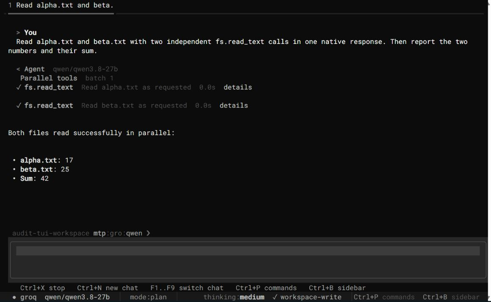
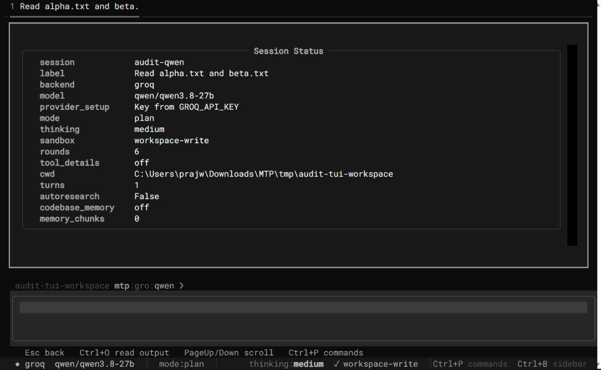

# CLI, SDK, and provider audit

Implementation update: all 18 original repros have been fixed in the 0.1.38
source. See [the implementation report](../../AUDIT_FIXES.md). The findings and
results below describe the original audited revision.

Audit date: 2026-10-03, Asia/Calcutta. Package: MTPX 0.1.37. Starting commit:
`72ffb74`. Work stayed on `main`.

The batch engine works on the tested happy paths. It is not ready for a claim of
reliable, interchangeable provider support. This audit reproduces 18 failures,
finds broken installation and CI contracts, and confirms outdated provider
guides and defaults.

This is an audit with executable repros. Production behavior and the original
provider guides were not rewritten. The defects remain unresolved. Strict
expected-failure markers make the repros visible without breaking unrelated
development. Run them with `--runxfail` to see the actual failures.

## Scope and evidence

- CLI parsing, diagnostics, provider listing, all three scaffold templates,
  local entrypoint execution, round validation, codebase scan/status/off, and
  installation from a built wheel.
- All 15 real provider adapters and the mock planner. New adapter tests execute
  independent and dependent native calls through the actual runtime.
- Real installed SDK serialization and parsing through a loopback HTTP server,
  including a second request carrying tool results. No other live provider key
  was used.
- Live Groq parallel, sequential `$ref`, and mixed batches; async events; native
  final-answer streaming; usage; session reload; and user-scoped session reads.
- Actual Textual TUI through `textual-serve`, with separate audit sessions and a
  synthetic workspace containing `alpha.txt` and `beta.txt`.
- Envelope HTTP, stdio subprocess, and WebSocket round trips; MCP HTTP and
  WebSocket initialization/tool execution; negotiation, Origin, and error codes.
- Official provider docs, retirement notices, and current model catalogs for
  the contracts discussed below. Groq's authenticated model list and
  OpenRouter's public model list were queried.
- Packaging, assets, runtime compatibility, compilation, dependencies, and
  source coverage.

Only Groq was tested against a live inference service. Loopback checks establish
serialization and decoding, not vendor acceptance, available models, account
permissions, or multimodal correctness. Ollama and LM Studio inference servers
were not running. Together and Fireworks used their OpenAI client paths in the
wire tests. The native Fireworks global-key issue has a synthetic SDK-branch
repro, not a live native-SDK request.

## Results

| Check | Result | Meaning |
|---|---|---|
| Original fast suite, existing environment | 622 passed, 11 deselected | Existing tests were green before new probes |
| Original integration selection | No tests selected | CI explicitly converted the no-tests status to success |
| New positive audit checks | 53 passed | 30 adapter batch cases, 4 runtime checks, 14 SDK cases, 5 transport cases |
| New checks with `--runxfail` | 18 failed, 53 passed | Reproduced failures, not review speculation |
| Final full non-live suite | See `evidence-summary.json` | Strict expected failures represent unresolved defects |
| Existing-suite source coverage | 52% | Multiple adapters had 0%; MCP transport had 10% |
| Suite plus audit source coverage | 61% | Substantial behavior remains uncovered |
| Compile checks | Passed | `src`, `tests`, and `examples` |
| Packaging | Wheel and sdist built | TUI CSS and all nine templates were included |
| Wheel-only install | Passed | Provider listing and scaffolding worked |
| Dependency consistency | Passed | `pip check` found no broken installed dependencies |
| New Python file lint | Passed | No unrelated source files were reformatted |
| CI-like core install plus pytest | Six collection errors | CI omits `pytest-asyncio` |

The isolated environment skipped Streamlit tests because Streamlit was absent;
those tests passed in the initial user environment. The 11 live Xiaomi cases
were deselected. The broader Ruff scan found hundreds of import, exception, and
style issues. They are not counted as confirmed runtime defects.

Audit versions: Python 3.13.3, Textual 8.2.8, OpenAI 3.24.0, Groq 1.7.0,
Anthropic 1.11.0, google-genai 2.28.0, Cohere 7.2.0, Mistral 3.0.0, Ollama 0.6.3,
Cerebras SDK 1.91.0, pytest 9.1.1. These are the tested versions, not newly
declared compatibility ranges.

## Reproduced defects

P1 means fix before relying on the affected behavior. P2 means an incorrect
contract, integration failure, or operational defect to fix next.

| ID | Priority | Finding and consequence | Code location |
|---|---|---|---|
| A01 | P1 | Parallel execution deduplicates identical non-cacheable WRITE calls. Two requested writes execute once; the second result is marked cached. Side effects change silently. | `src/mtp/runtime.py:490` |
| A02 | P1 | A failed prerequisite still permits its dependent handler. The runtime checks presence rather than success, so a subsequent action can execute after failed preparation. | `src/mtp/runtime.py:462`, `_resolve_refs` at 266 |
| A03 | P1 | Documented references to prior execution rounds fail. Every plan starts with an empty result map and rejects dependencies outside that plan. | `src/mtp/runtime.py:453`, `src/mtp/schema.py:396`, `docs/TOOL_CALL_SYNTAX.md` |
| A04 | P1 | Trimming repeated cached calls leaves their IDs in the assistant wire message without matching tool results. Strict providers can reject the next request. | `src/mtp/agent.py:708`, 1232, 1614, 2168, 2543 |
| A05 | P1 | Message-count history trimming can retain tool results after removing the assistant tool-call message. The resulting conversation is invalid. | `src/mtp/agent.py:996` |
| A06 | P1 | Anthropic receives dotted built-in names such as `calculator.add`, which violate its documented tool-name regex. | `src/mtp/providers/anthropic_provider.py:61` |
| A07 | P1 | DeepSeek reasoning models receive no tools because the adapter implements an obsolete restriction. | `src/mtp/providers/deepseek_provider.py:130` |
| A08 | P1 | Gemini rebuilds function-call parts and loses opaque thought signatures. The repro uses actual SDK Part objects when installed. | `src/mtp/providers/gemini_provider.py:234`, 377 |
| A09 | P1 | Ollama streaming replaces previous calls with each chunk's array. Two calls in different chunks become one call. | `src/mtp/providers/ollama_provider.py:296` |
| A10 | P2 | MCP initialization echoes unsupported versions, including `9999-01-01`, instead of rejecting them or selecting a supported revision. | `src/mtp/mcp.py:468` |
| A11 | P1 | MCP HTTP accepts an untrusted Origin instead of returning 403. The protocol's DNS-rebinding defense is absent. | `src/mtp/mcp_transport.py:269` |
| A12 | P1 | Current Anthropic SDK rejects the unconditional `temperature` argument before sending any HTTP request. Unbounded extras admit this incompatible version. | `src/mtp/providers/anthropic_provider.py:252`, 322 |
| A13 | P2 | An unknown MCP method returns invalid-params `-32602` instead of method-not-found `-32601`. | `src/mtp/mcp.py:449`, request exception mapping |
| A14 | P1 | WebsiteToolkit validates only the initial URL, then accepts a redirect's private-network response. The repro substitutes the HTTP boundary; no internal network was contacted. | `src/mtp/toolkits/website_toolkit.py:73` |
| A15 | P2 | README's `mtp run my-agent` fails parsing. The implemented syntax is `mtp run --path my-agent`. | `README.md`, `src/mtp/cli/main.py:275` |
| A16 | P2 | Async event streaming iterates a blocking synchronous final stream on its event loop. A concurrent heartbeat cannot run during the wait. | `src/mtp/agent.py:2665` |
| A17 | P1 | Native Fireworks wrapper shares the global SDK API key. Constructing a second provider changes the credential used by the first. | `src/mtp/providers/fireworks_provider.py:82` |
| A18 | P1 | Cohere advertises `calculator__add` but replays `calculator.add`. Definitions and assistant history use different provider identifiers. | `src/mtp/providers/cohere_provider.py:157`, 274 |

A01–A09 and A14–A18 are in `tests/test_audit_regressions.py`. A10, A11, and A13
are in `tests/test_transport_audit.py`. A12 is the conditional strict expected
failure in `tests/test_provider_sdk_contracts.py`; SDKs that still accept that
argument run it as a normal positive test.

## Other confirmed contract problems

### B01. Python 3.10 support is advertised incorrectly

`pyproject.toml:10` permits Python 3.10, but core imports use `datetime.UTC`, added
in Python 3.11. A subprocess that removes that newer attribute reproduces the
failure at `src/mtp/agent.py:6`. This is a simulation, not a run on an installed
Python 3.10 interpreter. Only Python 3.13 was installed here. Use `timezone.utc`
or raise the supported floor and align doctor, README, classifiers, and CI.
[Python documentation](https://docs.python.org/3/library/datetime.html#datetime.UTC).

### B02. Cerebras extra and doctor do not match the constructor

`mtpx[cerebras]` installs OpenAI, and CLI metadata checks OpenAI. The constructor
imports only `cerebras.cloud.sdk`; there is no OpenAI fallback. The aggregate
extras omit that SDK too. Doctor can report installed while construction fails.
The native SDK was installed separately for the wire test. The Cerebras guide's
fallback claim is false. See `pyproject.toml:50`, `src/mtp/cli/providers.py`, and
`src/mtp/providers/cerebras_provider.py:60`.

### B03. CI omits the async test runner

The workflows install pytest without `pytest-asyncio`. A clean core wheel
installation plus pytest produces six collection errors because strict markers
do not recognize `asyncio`. Registering the marker alone would not execute async
tests correctly. Install the runner and reproduce the exact CI dependency set.
The old integration job also concealed its empty test selection.

### B04. Defaults and model capabilities need one maintained source

- Anthropic Sonnet 3.5, the SDK/TUI default, was retired October 28, 2025. The
  guide's Haiku 3.5 and Opus 3 recommendations are retired too.
- Gemini 2.0 Flash, the SDK default and guide recommendation, shut down June 1,
  2026. The TUI separately defaults to an experimental Gemini 2.0 ID.
- OpenRouter's SDK default `qwen/qwen3.6-plus-preview:free` was absent from the
  current public model list. Its different TUI Qwen 2.5 default was listed with
  tools. Catalog absence is not a live inference test.
- Groq defaults to GPT-OSS-120B and advertises parallel support. The reviewed
  Groq docs mark that model as lacking parallel tool use. This account listed
  Qwen 3.8 and GPT-OSS, but Llama 3.3 requests returned 404.
- Mistral sends the parallel option while declaring no parallel support.
  Gemini's guide incorrectly says its API lacks parallel calls. Modality
  declarations are generally provider-wide rather than model-specific.

Preserve user-selected models. Maintain defaults, retirements, parameters, and
capabilities consistently across SDK, CLI, TUI, examples, and docs. Reject an
unavailable selection with a useful diagnostic instead of silently switching it.

### B05. A working directory is not an OS sandbox

The TUI `workspace-write` path changes ask rules to allow, including arbitrary
shell commands. Their working directory does not prevent access elsewhere.
PythonToolkit uses `-I`, which isolates the interpreter environment rather than
the filesystem/network, and never consults `allow_unsafe_exec`. Direct
FileToolkit path checks do reject paths outside the base. Those checks do not
confine arbitrary shell/Python execution. Separate permission policy from
claims of OS-enforced confinement.

### B06. Groq free-tier output budgeting is missing

An async final-stream request returned 429 because its expected 1,040 output
tokens exceeded this account's 1,000 OTPM limit. Waiting does not make that
individual request fit. Groq's constructor exposes no output-token budget.
An audit-only subclass added `max_completion_tokens=256`, after which the same
async streaming/session probes completed. Add a budget through planning and
finalization, retain rate-limit metadata, and avoid hiding or endlessly retrying
429 errors.

### B07. Reasoning replay and retries require provider-specific handling

DeepSeek's formatter drops `reasoning_content` from assistant history, though
thinking-mode tool requests require it. Together retries any exception after
dropping the parallel option, including unrelated auth/server errors. Fireworks
changes implementation merely because its optional SDK is installed. Restrict
compatibility fallbacks to the unsupported parameter and preserve diagnostics.

## Live Groq batch evidence

| Model | Case | Observed first response | Runtime proof | Result |
|---|---|---|---|---|
| Qwen 3.8 27B | Independent calculations | Three calls, one parallel batch | Outputs 42, 42, 91; intervals overlap | Pass |
| Qwen 3.8 27B | Sequential `$ref` chain | Four calls, four sequential batches | Inputs resolve through 12, 48, 16; final 31; no overlap | Pass |
| Qwen 3.8 27B | Mixed graph | Parallel then sequential | Outputs 42, 91, 84; independent intervals overlap | Pass |
| GPT-OSS-120B | Parallel and sequential requirements | One call in the first response | Requested single-response batch was not achieved | Fail for that requirement |
| GPT-OSS-120B | Mixed graph | API BadRequest | No verified graph execution | Fail |
| Llama 3.3 70B | All three shapes | API NotFound | Not listed for this account | Unavailable here |

Passing arithmetic alone is not batch verification. Evidence records response
plans, reference arguments, batch modes, handler starts/ends, and outputs.
Printed JSON in assistant text is not accepted as executable tool calling.

The budgeted supplementary probe confirmed contiguous async event sequences,
outputs 42/42/91, real final-text chunks, and final stream usage of 1,585 input
tokens and 40 output tokens. A new agent reloaded `LYRA-271` from a saved session;
another user ID could not read it. This does not establish database-backed
multi-user write isolation or high-concurrency safety.

## TUI verification and limitations

The browser displayed the actual MTP Textual application. It showed the Groq
Qwen selection, executed two independent `fs.read_text` calls in one parallel
group, displayed 17 and 25 with sum 42, and showed session status without the key.





The first run used default GPT-OSS. Browser keyboard control and delayed
rendering made shortcut outcomes uncertain; an unintended caret-prefixed status
prompt was interpreted as chat. That server was stopped. The successful run
used complete pasted input, Qwen, plan mode, and synthetic files. Escape and
cancellation were not certified by the browser run. Existing Textual Pilot tests
cover many offline flows and are separate evidence.

Windows Computer Use initialized and identified Edge, but capture/input recovery
failed. It then stopped because it could not confidently determine Edge's
current URL for policy enforcement. No further native actions were taken. A
separate shell attempt to launch Edge with the TUI URL was rejected as
"blocked by policy". The native terminal TUI was not manually certified.

## Provider documentation matrix

Every real adapter passed the synthetic independent/dependent batch matrix.
The wire column describes real SDK tests, not live vendor approval. Official
references were checked on the audit date with the fetch limitations noted.
Local pricing and free-credit marketing were not treated as verified.

| Provider | Wire check | Official reference | Documentation and implementation status |
|---|---|---|---|
| OpenAI | Pass | [Function calling](https://developers.openai.com/api/docs/guides/function-calling) | Chat Completions only. Current GPT-6 Astra/GPT-6.1 Sol tools require Responses. No native planning/final streaming. Document a tested legacy model subset. |
| Groq | Pass; live Qwen passes | [Tool use](https://console.groq.com/docs/tool-use/overview) | Model-independent parallel declaration, stale Llama example for this account, missing token budget. Only finalization has native streaming. |
| Anthropic | Fails with SDK 1.11.0 | [Tools](https://platform.claude.com/docs/en/agents-and-tools/tool-use/define-tools), [retirements](https://platform.claude.com/docs/en/about-claude/model-deprecations) | Dotted names, removed temperature parameter, retired recommendations. Thinking/state/streaming need explicit support. |
| Gemini | Pass for unsigned tools | [Functions](https://ai.google.dev/gemini-api/docs/function-calling), [thinking](https://ai.google.dev/gemini-api/docs/thinking), [deprecations](https://ai.google.dev/gemini-api/docs/deprecations) | Retired default, signature loss, incorrect no-parallel claim, union/reference branches discarded by schema sanitization. Signed multi-turn tests needed. |
| Cohere | Pass for underscore tool | [V2 chat](https://docs.cohere.com/reference/chat) | Dotted-name replay broken; `force_single_step` stored but unused. Narrow text/chat subset; grounded RAG not verified. |
| Mistral | Pass | [Functions](https://docs.mistral.ai/studio/conversations/function-calling) | Parallel option conflicts with capability/guide. Current SDK import fallback works. Text-only is an adapter limitation. |
| Cerebras | Pass after separate SDK install | [Tools](https://inference-docs.cerebras.ai/capabilities/tool-use), [versions](https://inference-docs.cerebras.ai/api-reference/versions) | Wrong extra/doctor SDK and nonexistent fallback claim. Old Llama defaults are not current shared-inference recommendations. Version-2 history/schema rules need tests. |
| DeepSeek | Pass for non-reasoner fixture | [Thinking](https://api-docs.deepseek.com/guides/thinking_mode/), [tools](https://api-docs.deepseek.com/guides/tool_calls/) | Obsolete reasoning-tool restriction and lost reasoning replay. Official search content was available; direct page requests timed out. |
| SambaNova | Pass with OpenAI | [Compatibility](https://docs.sambanova.ai/docs/en/features/openai-compatibility) | Basic client/chat contract matches. Modalities are not model-specific. Newer Responses/Messages/native streams not implemented; old defaults need cloud-catalog verification. |
| Together AI | Pass with OpenAI fallback | [Functions](https://docs.together.ai/docs/inference/function-calling/overview) | Basic format matches. Broad exception retry is wrong. Native SDK, current prices, model access, and vision unverified. |
| Fireworks AI | Pass with OpenAI fallback | [Tools](https://docs.fireworks.ai/guides/function-calling) | Native global-key wrapper breaks instance isolation; current docs use an instance client. Refresh old model/pricing claims and verify native SDK. |
| OpenRouter | Pass; catalog queried | [Tools](https://openrouter.ai/docs/guides/features/tool-calling), [catalog](https://openrouter.ai/api/v1/models) | SDK free preview absent from catalog; TUI differs. Routing/parameters/modalities need selected-model checks. |
| Xiaomi MiMo | Pass for text tools | [Reasoning replay](https://platform.xiaomimimo.com/docs/en-US/usage-guide/passing-back-reasoning_content) | Source preserves tool-round reasoning content and uses `extra_body` for thinking. Search content was available; the moved page was only partly fetchable. Token Plan/platform endpoints, media, thinking switching, budgets require live tests. |
| Ollama | Pass with native SDK | [Tools](https://docs.ollama.com/capabilities/tool-calling) | Basic shape and result `tool_name` match. Streaming drops earlier calls. Thinking/modalities depend on the model. No local inference ran. |
| LM Studio | Pass with OpenAI | [Tools](https://lmstudio.ai/docs/developer/openai-compat/tools) | Local OpenAI shape matches. Loaded models, streaming fragments, authentication, concurrency require a running server. |
| Mock | Existing tests cover it | Local deterministic implementation | Useful for unit tests; proves no vendor endpoint/model compatibility. |

Unsupported features are distinct from broken basic chat. Client-side JSON
validation is not provider-enforced structured output. Thread fallback is not
native async. Splitting completed text into chunks is not provider token
streaming. Capabilities and guides should state these differences.

## Providers worth adding

Fix existing contracts before expanding. A configurable OpenAI-compatible
adapter can remove repeated code, but still needs reversible tool names,
model-aware capabilities, provider-specific parameters, per-instance credentials,
and opaque reasoning-state preservation.

| Order | Provider | Route and required differences |
|---|---|---|
| 1 | Hugging Face Inference Providers | OpenAI-compatible router, HF token, model/provider suffixes and capability metadata. [Official guide](https://huggingface.co/docs/inference-providers/en/guides/gpt-oss). |
| 2 | DeepInfra | Chat Completions adapter with dedicated endpoint/key and model-level tool/vision checks. [Official guide](https://docs.deepinfra.com/chat/tool-calling). |
| 3 | Alibaba Model Studio / DashScope | Regional endpoint/key selection, Qwen thinking controls, model-specific parallel behavior, reasoning replay. [Official guide](https://www.alibabacloud.com/help/en/model-studio/qwen-function-calling). |
| 4 | Microsoft Foundry / Azure OpenAI | Deployment names, Azure endpoint, Entra credentials/token refresh, version differences. [Official guide](https://learn.microsoft.com/en-us/azure/foundry/openai/how-to/function-calling). |
| 5 | xAI / Grok | Responses-first integration; current docs treat Chat Completions as legacy. Preserve items, state, stream events, tool-output correlation and budgets. [Official guide](https://docs.x.ai/developers/tools/function-calling). |
| 6 | Amazon Bedrock | boto3 Converse/ConverseStream, IAM/region/model IDs, tool blocks, stop reasons and deltas. [Official guide](https://docs.aws.amazon.com/bedrock/latest/userguide/tool-use.html). |
| 7 | Google Cloud Vertex AI | Extend Gemini with project/location, ADC credentials, model names, signatures and supported schemas. [Official guide](https://docs.cloud.google.com/gemini-enterprise-agent-platform/models/tools/function-calling). |

NVIDIA NIM is another candidate. Its official function-calling URL returned no
readable content to the research tool, so it is not ranked as fully researched.
Check the selected model's current parameters before implementation.

No provider was added by this audit. Qwen is a model already served by Groq.
This order is an engineering recommendation, not a measured quality/cost ranking.

## MCP compatibility needs a defined revision

The server is initialize-based and defaults to `2026-03-26`. The current official
specification is `2026-07-28`, using per-request metadata and `server/discover`.
Older handshake revisions have different contracts. The checked-in April
compatibility matrix uses bespoke clients and does not establish current
third-party conformance.

Choose and enforce a supported revision, then test actual clients for discovery
or initialization, tools/resources/prompts, authentication, isolation,
cancellation, progress, and framing. Fix A10/A11/A13 independently of migration.
The custom `/events` replay route is not proof of standard Streamable HTTP
behavior. [Current versioning](https://modelcontextprotocol.io/specification/2026-07-28/basic/versioning),
[legacy HTTP Origin rules](https://modelcontextprotocol.io/specification/2025-11-25/basic/transports).

## Fix order

1. Write multiplicity, failed dependencies, cache/history integrity, atomic
   trimming. Make A01–A05 pass, then remove their expected-failure marks.
2. Provider identities/state: Anthropic names/current SDK, Gemini signatures,
   DeepSeek tools/reasoning, Cohere replay, Fireworks keys, Ollama stream calls.
   Require two-turn SDK tests for each corrected path.
3. Origin/version/error behavior and CI dependencies. Require a nonempty
   integration tier instead of success-on-no-tests.
4. Python floor, Cerebras extra/doctor, retired defaults, README run syntax,
   budgets, capabilities, and the provider guides together.
5. Blocking async stream iteration; stop/queue/concurrent-session checks during
   slow provider streams.
6. Provider additions after corrected contracts are reusable.

Remaining checks need services or credentials: non-Groq live inference, signed
Gemini/DeepSeek thinking turns, native Together/Fireworks SDKs, local models,
Postgres/MySQL, actual Python 3.10/3.11/3.12 runs, minimum Textual, cross-platform
terminal behavior, and current external MCP clients. This audit does not claim
those passed.

## Reproduction and saved evidence

```powershell
python -m pytest -q -m "not live"
python -m pytest -q tests/test_audit_regressions.py tests/test_provider_sdk_contracts.py tests/test_transport_audit.py --runxfail
python examples/audit_groq_protocol.py --models qwen/qwen3.8-27b --output tmp/groq-audit.json
python examples/audit_groq_sdk.py --output tmp/groq-sdk-audit.json
python -m build --outdir tmp/audit-dist
```

Use the recorded SDK versions for current-SDK failures. The live script reads
the existing Groq key without printing it. Saved evidence uses synthetic
prompts/results and excludes credentials, headers, and account IDs. Raw local
logs and disposable environments remain under ignored `tmp/` paths.

See `evidence-summary.json`, `provider-inventory.json`, `groq-batches.json`, and
`groq-sdk-events.json` beside this report. Production fixes remain to be made.
